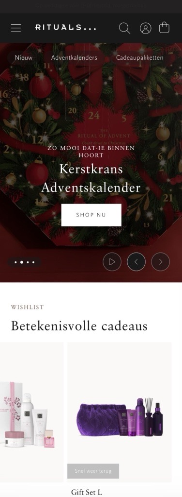

# Procesverslag
Markdown is een simpele manier om HTML te schrijven.  
Markdown cheat cheet: [Hulp bij het schrijven van Markdown](https://github.com/adam-p/markdown-here/wiki/Markdown-Cheatsheet).

Nb. De standaardstructuur en de spartaanse opmaak van de README.md zijn helemaal prima. Het gaat om de inhoud van je procesverslag. Besteedt de tijd voor pracht en praal aan je website.

Nb. Door *open* toe te voegen aan een *details* element kun je deze standaard open zetten. Fijn om dat steeds voor de relevante stuk(ken) te doen.

## Jij

  
uitwerken voor kick-off werkgroep

  ### Auteur:
  Linsy Bennis

  #### Je startniveau:
  Rood

  #### Je focus:
  surface plane
 

## Je website

  
uitwerken voor kick-off werkgroep

  ### Je opdracht:
  https://www.rituals.com/nl-nl/home

  #### Screenshot(s) van de eerste pagina (small screen): 
  home  
  

  #### Screenshot(s) van de tweede pagina (small screen):
  home-collectie 
  
 

## Toegankelijkheidstest 1/2 (week 1)

  
uitwerken na test in 2e werkgroep

  ### Bevindingen
  De Rituals website werkt over het algemeen goed met een screenreader. De koppen en structuur van de pagina zijn logisch opgebouwd, waardoor het makkelijk is om door de site te navigeren. 
  
  De meeste links en knoppen worden duidelijk aangekondigd en geven goed aan waar ze naartoe leiden. De productinformatie is ook uitgebreid, bij giftsets vertelt de screenreader bijvoorbeeld meteen welke producten erin zitten, wat handig is voor wie de afbeeldingen niet kan zien. Tegelijkertijd kan dit wel wat veel informatie tegelijk zijn, waardoor het soms onoverzichtelijk wordt.
  
  Toch zijn er ook nog punten die beter kunnen. Er zijn nog steeds enkele links die alleen als “koppeling” worden voorgelezen zonder verdere uitleg, wat verwarrend kan zijn. Daarnaast reageren sommige pop-ups en menu’s niet goed op de screenreader of toetsenbordbediening, waardoor het moeilijk is om daar doorheen te gaan.

  <b>WCAG checklist bevindingen</b>  
  De Rituals-website is al redelijk toegankelijk. De structuur is logisch, de koppen zijn duidelijk en de meeste teksten, links en knoppen werken goed met een screenreader. Ook het kleurcontrast en de vormgeving zijn toegankelijk.

  Er zijn wel nog een paar verbeterpunten. Sommige afbeeldingen hebben geen of een te vage alt-tekst, waardoor het niet altijd duidelijk is wat ze betekenen. Interactieve onderdelen, zoals pop-ups en menu’s, werken niet altijd goed met de focus, het kan wel verspringen, maar blijft alsnog soms hangen. Ook missen sommige video’s en audiofragmenten nog ondertiteling of transcripties.

## Breakdownschets (week 1)

  
uitwerken na afloop 3e werkgroep

  ### de hele pagina: 
  

  ### dynamisch deel (bijv menu): 
  

  ### wellicht nog een dynamisch deel (bijv filter): 
  

## Voortgang 1 (week 2)

  
uitwerken voor 1e voortgang

  ### Stand van zaken
  hier dit ging goed & dit was lastig (neem ook screenshots op van delen van je website en code)

  ### Agenda voor meeting
  samen met je groepje opstellen

  | student 1      | student 2          | student 3    | student 4        |
  | ---            | ---                | ---          | ---              |
  | dit bespreken  | en dit             | en ik dit    | en dan ik dat    |
  | en dat ook nog | dit als er tijd is | nog een punt | dit wil ik zeker |
  | ...            | ...                | ...          | ...              |

  ### Verslag van meeting
  hier na afloop snel de uitkomsten van de meeting vastleggen

  - punt 1
  - punt 2
  - nog een punt
  - ...

## Voortgang 2 (week 3)

  
uitwerken voor 2e voortgang

  ### Stand van zaken
  hier dit ging goed & dit was lastig (neem ook screenshots op van delen van je website en code)

  ### Agenda voor meeting
  samen met je groepje opstellen

  | student 1      | student 2          | student 3    | student 4        |
  | ---            | ---                | ---          | ---              |
  | dit bespreken  | en dit             | en ik dit    | en dan ik dat    |
  | en dat ook nog | dit als er tijd is | nog een punt | dit wil ik zeker |
  | ...            | ...                | ...          | ...              |

  ### Verslag van meeting
  hier na afloop snel de uitkomsten van de meeting vastleggen

  - punt 1
  - punt 2
  - nog een punt
- ...

## Toegankelijkheidstest 2/2 (week 4)

  
uitwerken na test in 9e werkgroep

  ### Bevindingen
  Lijst met je bevindingen die in de test naar voren kwamen (geef ook aan wat er verbeterd is):

## Voortgang 3 (week 4)

  
uitwerken voor 3e voortgang

  ### Stand van zaken
  hier dit ging goed & dit was lastig (neem ook screenshots op van delen van je website en code)

  ### Agenda voor meeting
  samen met je groepje opstellen

  | student 1      | student 2          | student 3    | student 4        |
  | ---            | ---                | ---          | ---              |
  | dit bespreken  | en dit             | en ik dit    | en dan ik dat    |
  | en dat ook nog | dit als er tijd is | nog een punt | dit wil ik zeker |
  | ...            | ...                | ...          | ...              |

  ### Verslag van meeting
  hier na afloop snel de uitkomsten van de meeting vastleggen

  - punt 1
  - punt 2
  - nog een punt
  - ...

## Eindgesprek (week 5)

  
uitwerken voor eindgesprek

  ### Je uitkomst - karakteristiek screenshots:
  

  ### Dit ging goed/Heb ik geleerd: 
  Korte omschrijving met plaatjes

  

  ### Dit was lastig/Is niet gelukt:
  Korte omschrijving met plaatjes

  

## Bronnenlijst

  
continu bijhouden terwijl je werkt

  Nb. Wees specifiek ('css-tricks' als bron is bijv. niet specifiek genoeg). 
  Nb. ChatGpT en andere AI horen er ook bij.
  Nb. Vermeld de bronnen ook in je code.

  1. bron 1
  2. bron 2
  3. ...

