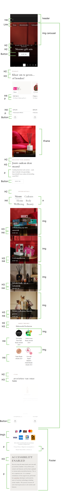

# Procesverslag
Markdown is een simpele manier om HTML te schrijven.  
Markdown cheat cheet: [Hulp bij het schrijven van Markdown](https://github.com/adam-p/markdown-here/wiki/Markdown-Cheatsheet).

Nb. De standaardstructuur en de spartaanse opmaak van de README.md zijn helemaal prima. Het gaat om de inhoud van je procesverslag. Besteedt de tijd voor pracht en praal aan je website.

Nb. Door *open* toe te voegen aan een *details* element kun je deze standaard open zetten. Fijn om dat steeds voor de relevante stuk(ken) te doen.

## Jij

  
uitwerken voor kick-off werkgroep

  ### Auteur:
  Linsy Bennis

  #### Je startniveau:
  Blauw

  #### Je focus:
  Responsive
 

## Je website

  
uitwerken voor kick-off werkgroep

  ### Je opdracht:
  https://www.rituals.com/nl-nl/home

  #### Screenshot(s) van de eerste pagina (small screen): 
  home  
  

  #### Screenshot(s) van de tweede pagina (small screen):
  beauty
  
 

## Toegankelijkheidstest 1/2 (week 1)

  
uitwerken na test in 2e werkgroep

  ### Bevindingen
  De Rituals website werkt over het algemeen goed met een screenreader. De koppen en structuur van de pagina zijn logisch opgebouwd, waardoor het makkelijk is om door de site te navigeren. 
  
  De meeste links en knoppen worden duidelijk aangekondigd en geven goed aan waar ze naartoe leiden. De productinformatie is ook uitgebreid, bij giftsets vertelt de screenreader bijvoorbeeld meteen welke producten erin zitten, wat handig is voor wie de afbeeldingen niet kan zien. Tegelijkertijd kan dit wel wat veel informatie tegelijk zijn, waardoor het soms onoverzichtelijk wordt.
  
  Toch zijn er ook nog punten die beter kunnen. Er zijn nog steeds enkele links die alleen als “koppeling” worden voorgelezen zonder verdere uitleg, wat verwarrend kan zijn. Daarnaast reageren sommige pop-ups en menu’s niet goed op de screenreader of toetsenbordbediening, waardoor het moeilijk is om daar doorheen te gaan.

  <b>WCAG checklist bevindingen</b> 
  De Rituals-website is al redelijk toegankelijk. De structuur is logisch, de koppen zijn duidelijk en de meeste teksten, links en knoppen werken goed met een screenreader. Ook het kleurcontrast en de vormgeving zijn toegankelijk.

  Er zijn wel nog een paar verbeterpunten. Sommige afbeeldingen hebben geen of een te vage alt-tekst, waardoor het niet altijd duidelijk is wat ze betekenen. Interactieve onderdelen, zoals pop-ups en menu’s, werken niet altijd goed met de focus, het kan wel verspringen, maar blijft alsnog soms hangen. Ook missen sommige video’s en audiofragmenten nog ondertiteling of transcripties.

## Breakdownschets (week 1)

  
uitwerken na afloop 3e werkgroep

  ### de hele pagina: 
  

  ### dynamisch deel (bijv menu): 
  

  ### wellicht nog een dynamisch deel (bijv filter): 
  

## Voortgang 1 (week 2)

  
uitwerken voor 1e voortgang

  ### Stand van zaken
 Ik ben goed begonnen, ik blijf goed bij de lessen en heb nu de html van 1 pagina af en een beetje van de css.

  ### Agenda voor meeting
  samen met je groepje opstellen

  | Linsy                 | Rohit                       | student 3    | student 4        |
  | ---                   | ---                            | ---          | ---              |
  |  foto in select       | Is mijn css goed ingedeeld   |
  |  hamburger menu maken |  
  | is mn html goed       | ...                            | ...          | ...              |

  ### Verslag van meeting
  
Ik had mijn HTML laten checken om te kijken of alles goed was opgebouwd. Ze vonden mijn HTML duidelijk en logisch ingedeeld, dus dat was goed. Ik had ook gevraagd waarom ik geen foto's in een select kon zetten, maar dit wisten zij zelf ook niet. Ze hebben het opgezocht maar konden niks vinden. 
Toen had ik noch gevraagd over hoe de Roots werken en hoe ik hier kleuren en fonts in kon zetten, hier hebben ze me mee geholpen door eentje samen te maken, hierdoor snapte ik gelijk hoe het werkte.

## Voortgang 2 (week 3)

  
uitwerken voor 2e voortgang

  ### Stand van zaken
  Ik ben goed opweg, ik heb niet veel vragen, en vooral korte vragen.

  ### Agenda voor meeting
  samen met je groepje opstellen

  | Linsy                             | Rohit                     | Frank       |
  | ---                               | ---                       | ---                | ---              |
  | lijn bij producten                | Goed grid neerzetten      | Hulp met Javascript| en dan ik dat    |
  | footer uitklap stuk               | Knop maken met javascript | Hulp met Grid      | dit wil ik zeker |
  | header justify content werkt niet | ...                       | ...                | ...              |
    foto in form

  ### Verslag van meeting
  Ik had gevraagd hoe ik een plaatje in een select kon zetten, omdat dit mij niet lukte. Ik werd hier goed mee geholpen en ik kreeg voorbeeldcode zodat ik het kon begrijpen. Ook heb ik gevraagd hoe ik een carousel kon maken. Dit werd duidelijk uitgelegd en hiervoor kreeg ik ook voorbeeldcode. Verder kreeg ik het advies dat ik geen articles hoef te gebruiken als dat niet nodig is.

  Ik kan dus goed verder gaan met deze feedback.
- ...

## Toegankelijkheidstest 2/2 (week 4)

  
uitwerken na test in 9e werkgroep

  ### Bevindingen
  In week 2 heb ik mijn eigen site getest. Vergeleken met de eerste test is er al duidelijk verbetering. De screenreader kan nu beter door de pagina heen, omdat de structuur logischer is geworden. De meeste knoppen en links worden goed voorgelezen en de toetsenbordnavigatie werkt bijna overal zoals het zou moeten.

Wat nog beter kan, is dat niet alle headings al aanwezig zijn. Op sommige plekken moet ik nog duidelijke koppen toevoegen zodat iedereen de pagina goed kan lezen. Ook moeten een paar alt-teksten nog specifieker gemaakt worden, en soms gaat de focus nog niet helemaal naar het juiste element.

## Voortgang 3 (week 4)

  
uitwerken voor 3e voortgang

  ### Stand van zaken
  Ik ben goed opweg, ik heb niet veel vragen, en vooral korte vragen.

  ### Agenda voor meeting
  samen met je groepje opstellen

  | Linsy                             | Rohit                            
  | fouten in html               | Goed uitlijnen grid     
  | mag display none               | wat is de goede volgorde van css | 
  |            | ...              | ...                | ...           

  ### Verslag van meeting
  Ik heb gevraagd over errors in mijn html, ik kan er eigenlijk niks aan veranderen want anders werkt het niet. Dit mocht aangezien hun ook niet wisten hoe ik die errors weg zou kunnen halen, en omdat ik er een goede onderbouwing voor heb.

  Ik heb gevraagd of ik de tekst op de juiste manier liet verschijnen, door middel met display none, bij belangrijke elementen mag dit niet maar omdat dat van mij niet belangrijk was mocht het wel.

  Toen heb ik als tip gekregen dat ik nog in elke section headings moest toevoegen, ook als je ze niet ziet op de pagina. En er werd gezegd dat het handig zou zijn als ik mijn read me beter bij hou.

## Eindgesprek (week 5)

  
uitwerken voor eindgesprek

  ### Je uitkomst - karakteristiek screenshots:
  
  

  ### Dit ging goed/Heb ik geleerd: 
  Ik vond dat het responsive maken van mijn website behoorlijk goed ging, ik heb op veel plekken gebruik gemaakt van media qeuries om ervoor te zorgen dat het op alle schermformaten er goed uit ziet. 
  
  Vooral voor klein scherm heb ik hem heel responsive gemaakt, onder 400 px ging veel tekst eerst op elkaar staan of werd het afgeknipt, dit maakt de site moeilijk te gebruiken en dus heb ik dit verbetererd door media qeuries toe te voegen.

  Ik had nog niet eerder sites responsive moeten maken, dus ik heb hier voor het eerst geleerd hoe het moest en hoe ik het daadwerkelijk toe kon passen op mijn site.

  

  

  ### Dit was lastig/Is niet gelukt:
  Toch was responsive maken ook erg moeilijk, het enige gedeelte waar het echt niet gelukt was, was in de header. Eigenlijk moest de nav op de header komen te staan ipv in het menu, dit was me wel gelukt maar het paste toen op de hele header. Toen wou ik net zoals op de site van Rituals het logo naar boven verplaatsen en de icons naar rechts, dit lukte niet. Ik kon de volgorde niet goed krijgen, en als ik iets veranderde ging de nav weer van de header af, dus toen werd ik te gefrustreerd en ben ik gestopt.

  

echte site

## Bronnenlijst

  
continu bijhouden terwijl je werkt

  1. https://www.a11yproject.com/posts/how-to-hide-content/
  2. https://codepen.io/shooft/pen/myepoJo
  3. https://codepen.io/shooft/pen/EaKLRLO
  4. https://codepen.io/shooft/pen/ogxdyRN
  5. https://una.im/select-updates/
  6. https://developer.mozilla.org/en-US/docs/Web/CSS/Reference/At-rules/@font-face/font-display

